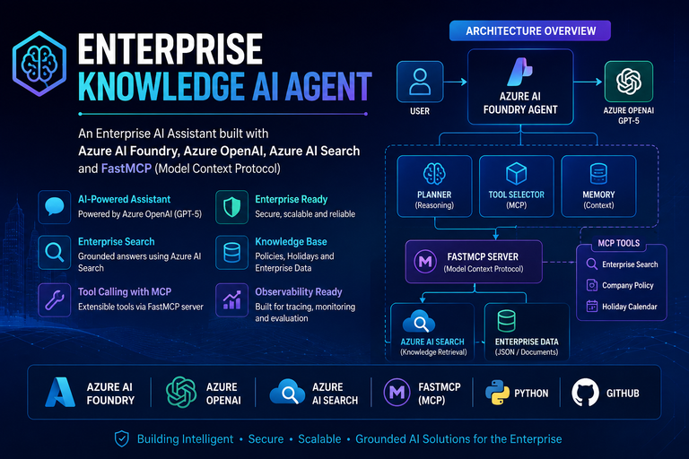

<p align="center">
  
</p>


# 🚀 Enterprise Knowledge AI Agent

An enterprise-grade AI assistant built using **Microsoft Azure AI Foundry**, **Azure OpenAI**, **Azure AI Search**, and **FastMCP**.

This project demonstrates how to build a grounded AI agent capable of answering enterprise questions using Azure AI Search and invoking custom tools through the Model Context Protocol (MCP).

---

## ✨ Features

- Azure AI Foundry Agent
- Azure OpenAI GPT-5
- Azure AI Search Knowledge Base
- FastMCP Server
- Enterprise Search Tool
- Company Policy Tool
- Holiday Calendar Tool
- Retrieval-Augmented Generation (RAG)
- Grounded Responses
- Tool Calling

---

## 🏗️ Architecture

> Architecture diagram will be added.

---

## 🛠️ Tech Stack

| Technology | Purpose |
|------------|---------|
| Python | Backend |
| Azure AI Foundry | AI Agent |
| Azure OpenAI | LLM |
| Azure AI Search | Knowledge Retrieval |
| FastMCP | MCP Server |
| JSON | Enterprise Data |
| GitHub | Version Control |

---

## 📁 Project Structure

```text
Enterprise-Knowledge-AI-Agent/
│
├── mcp_server/
│   ├── config.py
│   ├── search.py
│   ├── server.py
│   ├── tools.py
│   └── data/
│       ├── company_policy.json
│       └── holiday_calendar.json
│
├── requirements.txt
├── README.md
├── test_search.py
└── test_tools.py
```

---

## ⚙️ Setup

```bash
git clone https://github.com/tarunyadav24/Enterprise-Knowledge-AI-Agent.git

cd Enterprise-Knowledge-AI-Agent

pip install -r requirements.txt

python mcp_server/server.py
```

---

## 📌 Future Enhancements

- Planner
- Memory
- Observability
- Evaluations
- Tracing
- Multi-Agent Support
- Microsoft Teams Integration
- SharePoint Integration

---

## 👨‍💻 Author

**Tarun Yadav**

- Azure AI Foundry
- Azure OpenAI
- Azure AI Search
- FastMCP
- Agentic AI
